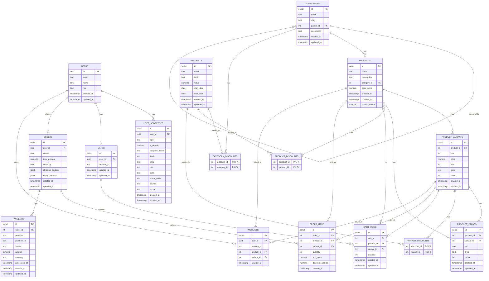

# 🛋️ Sofa Deal E-Commerce Platform

<div align="center">


</div>

A modern, scalable e-commerce platform for furniture retail built with Next.js, NestJS, and Supabase. This platform offers a rich shopping experience with features like 360° product views, typo-tolerant search, secure payment processing, and comprehensive order management

## 🌟 Features

- **Modern Web Architecture** - Next.js frontend, NestJS backend, and Supabase for database/auth/storage
- **Product Showcase** - Interactive 360° product views, image galleries, and detailed descriptions
- **Smart Search** - Typo-tolerant search with PostgreSQL full-text search and trigram matching
- **Secure Payments** - PCI-DSS compliant checkout with Stripe and PayPal integration
- **User Management** - Customer accounts, guest checkout, and role-based admin access
- **Discount System** - Flexible discount application to categories, products, or variants
- **Order Processing** - Comprehensive order lifecycle management
- **Notifications** - Email and WhatsApp Business API for order updates
- **Analytics Integration** - Google Analytics, Facebook Pixel, and Search Console
- **Mobile-Friendly Design** - Responsive layout for all screen sizes

## 🔧 Tech Stack

- **Frontend**: Next.js, React, ShadCN UI, Tailwind CSS
- **Backend**: NestJS, TypeScript
- **Database**: PostgreSQL (via Supabase)
- **Authentication**: Supabase Auth
- **Storage**: Supabase Storage
- **Search**: PostgreSQL Full-Text Search with trigram matching
- **Payments**: Stripe, PayPal
- **Messaging**: Email service, WhatsApp Business API

## 🚀 Deployment

This application is configured for Railway deployment with automatic CI/CD pipeline that deploys on every push to the `dev` branch.

**🎯 Auto-deployment is now ACTIVE!** Every push to `dev` branch will automatically deploy to Railway.

### Railway Setup

1. **Create a Railway Account**
   - Visit [Railway](https://railway.app) and create an account
   - Connect your GitHub repository

2. **Deploy to Railway**
   ```bash
   # Install Railway CLI
   npm install -g @railway/cli
   
   # Login to Railway
   railway login
   
   # Initialize project (run in your project directory)
   railway init
   
   # Deploy the application
   railway up
   ```

3. **Environment Variables**
   Set the following environment variables in your Railway dashboard:
   ```
   NODE_ENV=production
   PORT=3000
   SUPABASE_URL=your_supabase_url
   SUPABASE_ANON_KEY=your_supabase_anon_key
   SUPABASE_SERVICE_ROLE_KEY=your_service_role_key
   JWT_SECRET=your_jwt_secret
   FRONTEND_URL=your_frontend_url
   ```

### CI/CD Pipeline Setup

The project includes a GitHub Actions workflow (`.github/workflows/deploy-dev.yml`) that automatically:
- Runs tests and linting on every push/PR to dev branch
- Deploys to Railway on successful push to dev branch

**Setup Steps:**

1. **Get Railway Token**
   ```bash
   # Login to Railway CLI
   railway login
   
   # Get your token
   railway whoami
   ```

2. **Add GitHub Secret**
   - Go to your GitHub repository settings
   - Navigate to Secrets and Variables → Actions
   - Add a new secret named `RAILWAY_TOKEN` with your Railway token

3. **Configure Branch Protection**
   - Set up branch protection rules for your `dev` branch
   - Require status checks to pass before merging
   - Require pull request reviews

### Manual Deployment

For manual deployments or local testing:

```bash
# Build the application
npm run build

# Start production server
npm run start:prod

# Or using Docker
docker build -t sopa-deal-backend .
docker run -p 3000:3000 sopa-deal-backend
```

### Railway Configuration

The project includes `railway.toml` with optimized settings:
- Dockerfile-based deployment
- Health checks configured
- Automatic restart policy
- Optimized build process

### Deployment Features

- **Automatic Deployments**: Push to `dev` branch triggers deployment
- **Health Checks**: Built-in health monitoring
- **Docker Optimized**: Multi-stage Docker build for smaller images
- **Zero Downtime**: Railway handles rolling deployments
- **Logs & Monitoring**: Access logs through Railway dashboard
- **Custom Domains**: Easy custom domain setup through Railway

## 🗄️ Database Schema

The database schema is designed to support all e-commerce functionality, including product management, shopping cart, checkout, and order processing. Below is a visualization of the database relationships:

