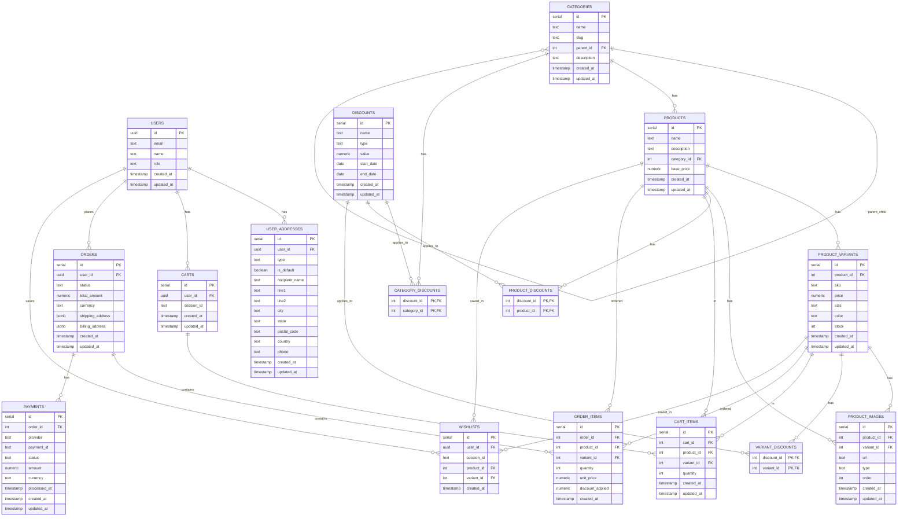

# Sofa Deal E-Commerce Database Schema

This document provides a detailed explanation of the database schema for the Sofa Deal E-Commerce platform. The schema is designed to support all the requirements for the online furniture store, including product management, shopping cart functionality, order processing, and discount management.

## Tables Overview

The database consists of the following tables:

1. **users** - User accounts and roles
2. **user_addresses** - User shipping and billing addresses
3. **categories** - Product categories with hierarchical structure
4. **products** - Product catalog entries
5. **product_variants** - Specific variations of products (size, color, etc.)
6. **product_images** - Images associated with products and variants
7. **discounts** - Discount definitions
8. **category_discounts** - Linking discounts to categories
9. **product_discounts** - Linking discounts to products
10. **variant_discounts** - Linking discounts to product variants
11. **carts** - Shopping carts for users or guests
12. **cart_items** - Items in shopping carts
13. **orders** - Customer orders
14. **order_items** - Items in customer orders
15. **payments** - Payment records for orders
16. **wishlists** - Wishlist items for both authenticated and guest users

## Detailed Table Descriptions

### Users Table

Stores information about registered users including their role in the system.

| Column | Type | Description |
|--------|------|-------------|
| id | UUID | Primary key, references auth.users(id) from Supabase Auth |
| email | TEXT | User's email address |
| name | TEXT | User's full name |
| role | TEXT | User's role ('customer', 'admin', or 'editor') |
| created_at | TIMESTAMP WITH TIME ZONE | When the record was created |
| updated_at | TIMESTAMP WITH TIME ZONE | When the record was last updated |

**Relationships:**
- Referenced by `carts.user_id`
- Referenced by `orders.user_id`
- Referenced by `user_addresses.user_id`

### User Addresses Table

Stores multiple shipping and billing addresses for users.

| Column | Type | Description |
|--------|------|-------------|
| id | SERIAL | Primary key |
| user_id | UUID | References users.id |
| type | TEXT | Address type ('shipping' or 'billing') |
| is_default | BOOLEAN | Whether this is the default address for the type |
| recipient_name | TEXT | Name of the recipient |
| line1 | TEXT | Address line 1 |
| line2 | TEXT | Address line 2 (optional) |
| city | TEXT | City |
| state | TEXT | State/Province/Region |
| postal_code | TEXT | Postal/ZIP code |
| country | TEXT | Country |
| phone | TEXT | Contact phone number |
| created_at | TIMESTAMP WITH TIME ZONE | When the record was created |
| updated_at | TIMESTAMP WITH TIME ZONE | When the record was last updated |

**Indexes:**
- Index on `user_id` for faster lookups
- Unique index on `user_id` and `type` where `is_default` is true (ensures only one default address per type per user)

**Relationships:**
- References `users` via `user_id`

### Categories Table

Stores product categories with support for hierarchical structure (categories and subcategories).

| Column | Type | Description |
|--------|------|-------------|
| id | SERIAL | Primary key |
| name | TEXT | Category name |
| slug | TEXT | URL-friendly unique identifier |
| parent_id | INTEGER | References another category as parent (for hierarchical structure) |
| description | TEXT | Category description |
| created_at | TIMESTAMP WITH TIME ZONE | When the record was created |
| updated_at | TIMESTAMP WITH TIME ZONE | When the record was last updated |

**Relationships:**
- Self-referencing via `parent_id` (hierarchical structure)
- Referenced by `products.category_id`
- Referenced by `category_discounts.category_id`

### Products Table

Stores product information.

| Column | Type | Description |
|--------|------|-------------|
| id | SERIAL | Primary key |
| name | TEXT | Product name |
| description | TEXT | Product description |
| category_id | INTEGER | References categories.id |
| base_price | NUMERIC(10, 2) | Base price of the product |
| created_at | TIMESTAMP WITH TIME ZONE | When the record was created |
| updated_at | TIMESTAMP WITH TIME ZONE | When the record was last updated |

**Relationships:**
- References `categories` via `category_id`
- Referenced by `product_variants.product_id`
- Referenced by `product_images.product_id`
- Referenced by `product_discounts.product_id`
- Referenced by `cart_items.product_id`
- Referenced by `order_items.product_id`

### Product Variants Table

Stores specific variants of products (e.g., different sizes, colors) with unique SKUs.

| Column | Type | Description |
|--------|------|-------------|
| id | SERIAL | Primary key |
| product_id | INTEGER | References products.id |
| sku | TEXT | Stock Keeping Unit (unique identifier) |
| price | NUMERIC(10, 2) | Price of this specific variant (overrides base price if set) |
| size | TEXT | Size of the product variant (e.g., Small, Medium, Large) |
| color | TEXT | Color of the product variant |
| stock | INTEGER | Number of items in stock |
| created_at | TIMESTAMP WITH TIME ZONE | When the record was created |
| updated_at | TIMESTAMP WITH TIME ZONE | When the record was last updated |

**Relationships:**
- References `products` via `product_id`
- Referenced by `product_images.variant_id`
- Referenced by `variant_discounts.variant_id`
- Referenced by `cart_items.variant_id`
- Referenced by `order_items.variant_id`

### Product Images Table

Stores image URLs for products and their variants, including support for 360° views.

| Column | Type | Description |
|--------|------|-------------|
| id | SERIAL | Primary key |
| product_id | INTEGER | References products.id |
| variant_id | INTEGER | References product_variants.id (nullable) |
| url | TEXT | URL or path to the image |
| type | TEXT | Image type ('main', 'gallery', or '360') |
| order | INTEGER | Ordering sequence for images |
| created_at | TIMESTAMP WITH TIME ZONE | When the record was created |
| updated_at | TIMESTAMP WITH TIME ZONE | When the record was last updated |

**Relationships:**
- References `products` via `product_id`
- References `product_variants` via `variant_id` (optional)

### Discounts Table

Defines discounts that can be applied to categories, products, or variants.

| Column | Type | Description |
|--------|------|-------------|
| id | SERIAL | Primary key |
| name | TEXT | Name of the discount |
| type | TEXT | Type of discount ('percent' or 'fixed') |
| value | NUMERIC(10, 2) | Discount value (percentage or fixed amount) |
| start_date | DATE | When the discount starts (optional) |
| end_date | DATE | When the discount ends (optional) |
| created_at | TIMESTAMP WITH TIME ZONE | When the record was created |
| updated_at | TIMESTAMP WITH TIME ZONE | When the record was last updated |

**Relationships:**
- Referenced by `category_discounts.discount_id`
- Referenced by `product_discounts.discount_id`
- Referenced by `variant_discounts.discount_id`

### Category Discounts Table

Junction table linking discounts to categories (many-to-many).

| Column | Type | Description |
|--------|------|-------------|
| discount_id | INTEGER | References discounts.id |
| category_id | INTEGER | References categories.id |

**Relationships:**
- References `discounts` via `discount_id`
- References `categories` via `category_id`

### Product Discounts Table

Junction table linking discounts to specific products (many-to-many).

| Column | Type | Description |
|--------|------|-------------|
| discount_id | INTEGER | References discounts.id |
| product_id | INTEGER | References products.id |

**Relationships:**
- References `discounts` via `discount_id`
- References `products` via `product_id`

### Variant Discounts Table

Junction table linking discounts to specific product variants (many-to-many).

| Column | Type | Description |
|--------|------|-------------|
| discount_id | INTEGER | References discounts.id |
| variant_id | INTEGER | References product_variants.id |

**Relationships:**
- References `discounts` via `discount_id`
- References `product_variants` via `variant_id`

### Carts Table

Stores shopping cart information for both registered users and guest shoppers.

| Column | Type | Description |
|--------|------|-------------|
| id | SERIAL | Primary key |
| user_id | UUID | References users.id (nullable for guest carts) |
| session_id | TEXT | Session identifier for guest carts |
| created_at | TIMESTAMP WITH TIME ZONE | When the record was created |
| updated_at | TIMESTAMP WITH TIME ZONE | When the record was last updated |

**Constraints:**
- CHECK constraint ensuring either `user_id` or `session_id` is not null

**Relationships:**
- References `users` via `user_id` (optional)
- Referenced by `cart_items.cart_id`

### Cart Items Table

Stores items in a shopping cart.

| Column | Type | Description |
|--------|------|-------------|
| id | SERIAL | Primary key |
| cart_id | INTEGER | References carts.id |
| product_id | INTEGER | References products.id |
| variant_id | INTEGER | References product_variants.id |
| quantity | INTEGER | Number of items |
| created_at | TIMESTAMP WITH TIME ZONE | When the record was created |
| updated_at | TIMESTAMP WITH TIME ZONE | When the record was last updated |

**Constraints:**
- CHECK constraint ensuring `quantity` is greater than 0
- UNIQUE constraint on `cart_id` and `variant_id` to prevent duplicate variants in cart

**Relationships:**
- References `carts` via `cart_id`
- References `products` via `product_id`
- References `product_variants` via `variant_id`

### Orders Table

Stores information about customer orders.

| Column | Type | Description |
|--------|------|-------------|
| id | SERIAL | Primary key |
| user_id | UUID | References users.id (nullable for guest orders) |
| status | TEXT | Order status ('pending', 'paid', 'shipped', 'delivered', 'cancelled') |
| total_amount | NUMERIC(10, 2) | Total order amount |
| currency | TEXT | Currency code (default: 'GBP') |
| shipping_address | JSONB | Shipping address details |
| billing_address | JSONB | Billing address details |
| created_at | TIMESTAMP WITH TIME ZONE | When the record was created |
| updated_at | TIMESTAMP WITH TIME ZONE | When the record was last updated |

**Relationships:**
- References `users` via `user_id` (optional)
- Referenced by `order_items.order_id`
- Referenced by `payments.order_id`

### Order Items Table

Stores individual items in an order.

| Column | Type | Description |
|--------|------|-------------|
| id | SERIAL | Primary key |
| order_id | INTEGER | References orders.id |
| product_id | INTEGER | References products.id |
| variant_id | INTEGER | References product_variants.id (nullable) |
| quantity | INTEGER | Number of items |
| unit_price | NUMERIC(10, 2) | Price per unit at time of order |
| discount_applied | NUMERIC(10, 2) | Discount amount applied |
| created_at | TIMESTAMP WITH TIME ZONE | When the record was created |

**Constraints:**
- CHECK constraint ensuring `quantity` is greater than 0

**Relationships:**
- References `orders` via `order_id`
- References `products` via `product_id`
- References `product_variants` via `variant_id` (optional)

### Payments Table

Stores payment information for orders.

| Column | Type | Description |
|--------|------|-------------|
| id | SERIAL | Primary key |
| order_id | INTEGER | References orders.id |
| provider | TEXT | Payment provider ('stripe' or 'paypal') |
| payment_id | TEXT | Provider's payment identifier |
| status | TEXT | Payment status ('pending', 'completed', 'failed', 'refunded') |
| amount | NUMERIC(10, 2) | Payment amount |
| currency | TEXT | Currency code (default: 'GBP') |
| processed_at | TIMESTAMP WITH TIME ZONE | When the payment was processed |
| created_at | TIMESTAMP WITH TIME ZONE | When the record was created |
| updated_at | TIMESTAMP WITH TIME ZONE | When the record was last updated |

**Relationships:**
- References `orders` via `order_id`

### Wishlists Table

Stores wishlist items for both authenticated and guest users.

| Column | Type | Description |
|--------|------|-------------|
| id | SERIAL | Primary key |
| user_id | UUID | References users.id (for authenticated users) |
| session_id | TEXT | Session identifier for guest users |
| product_id | INTEGER | References products.id |
| variant_id | INTEGER | References product_variants.id (nullable) |
| created_at | TIMESTAMP WITH TIME ZONE | When the record was created |

**Constraints:**
- CHECK constraint `wishlist_owner` ensuring either `user_id` OR `session_id` must be provided
- UNIQUE constraint `unique_wishlist_item_user` ensuring unique product/variant combinations per user
- UNIQUE constraint `unique_wishlist_item_session` ensuring unique product/variant combinations per session

**Relationships:**
- References `users` via `user_id` (optional, for authenticated users)
- References `products` via `product_id`
- References `product_variants` via `variant_id` (optional)

```sql
SELECT * FROM products
WHERE search_vector @@ websearch_to_tsquery('english', :query)
   OR name % :query
ORDER BY ts_rank(search_vector, websearch_to_tsquery('english', :query)) DESC;
```

## Database Relationships Diagram



This schema is designed to be flexible, efficient, and to support all the e-commerce functionality required for the Sofa Deal platform, including product browsing, search, cart management, checkout process, and order history. 